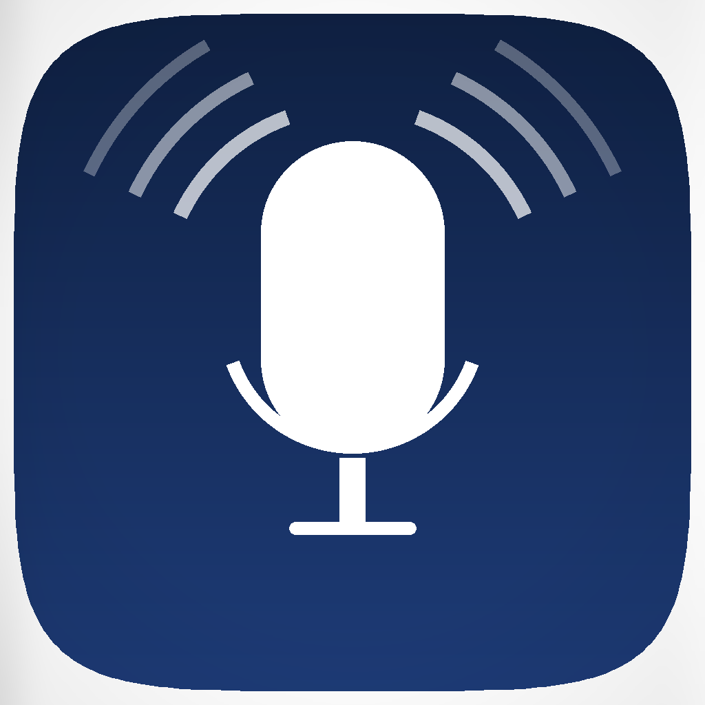
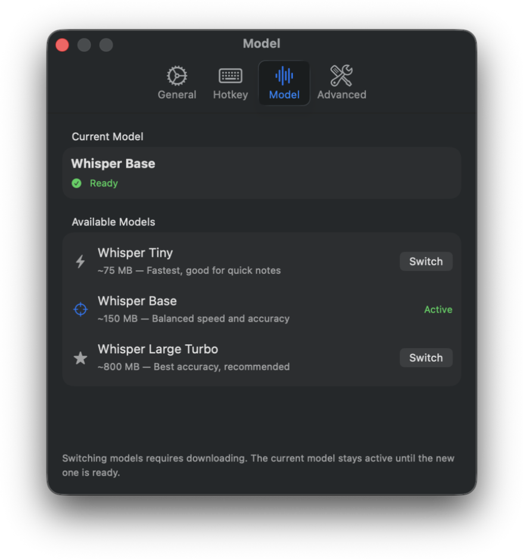
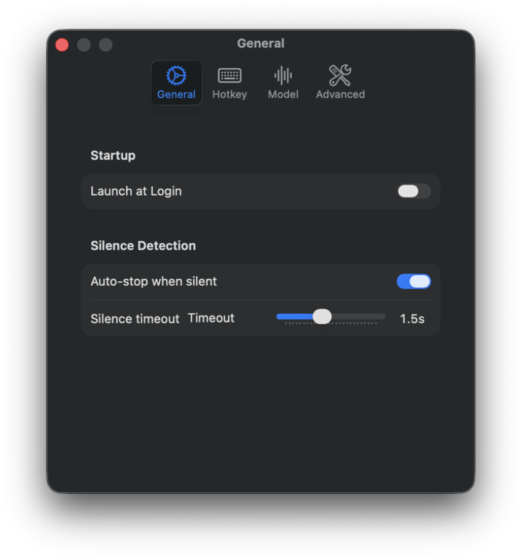
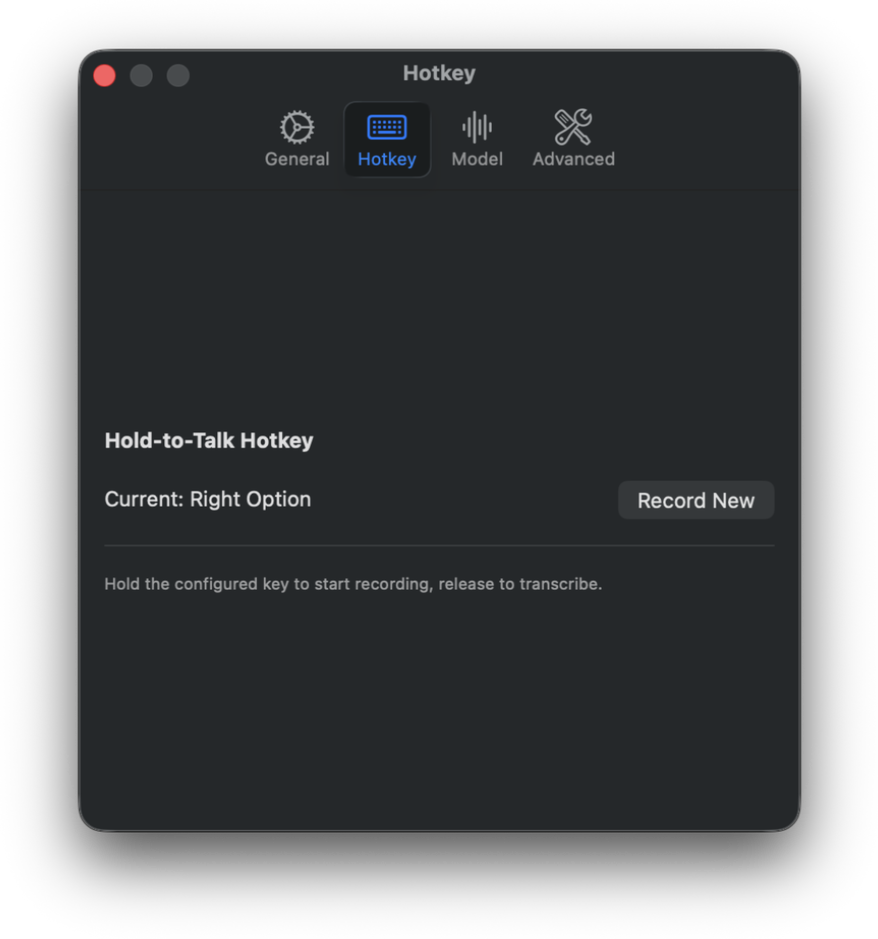

<p align="center">
  
</p>

<h1 align="center">VoxType</h1>

<p align="center">
  <strong>Press. Speak. Paste.</strong><br>
  On-device voice dictation for macOS — powered by <a href="https://github.com/argmaxinc/WhisperKit">WhisperKit</a>.
</p>

<p align="center">
  
  
  
  
</p>

---

<p align="center">
  
</p>

<p align="center">
  <em>Hold your hotkey, speak, release — text appears in any app.</em>
</p>

---

## Screenshots

<table align="center">
  <tr>
    <td align="center"><b>Onboarding</b></td>
    <td align="center"><b>Settings</b></td>
  </tr>
  <tr>
    <td></td>
    <td></td>
  </tr>
</table>

## How It Works

1. **Hold** your hotkey — recording starts, HUD appears near the menu bar
2. **Speak** — real-time audio level shown in the HUD
3. **Release** — audio is transcribed via WhisperKit and pasted into the active text field
4. Done — HUD shows the result briefly, then disappears

## Features

### Core Dictation
- **Hold-to-talk** — custom hotkey activates recording system-wide via CGEvent tap
- **On-device transcription** — WhisperKit runs locally, no internet required after model download
- **Auto-paste** — transcribed text is inserted via clipboard + Cmd+V simulation into any text field
- **Voice Activity Detection** — smart silence detection auto-stops recording when you stop speaking

### Menu Bar Experience
- **Floating HUD** — overlay with recording status, audio level visualization, and result preview
- **Status icon** — menu bar mic icon changes with state (idle, listening, transcribing, done, error)
- **LSUIElement** — no dock icon, lives entirely in the menu bar

### Model Management
- **Model selection** — choose between WhisperKit models (tiny, base, small) for speed vs. accuracy
- **One-click download** — download models directly from Settings with progress tracking
- **Model caching** — downloaded models persist across restarts, no re-downloading

### Settings & Customization
- **Custom hotkey** — record any key combination as your push-to-talk trigger
- **Launch at login** — optional auto-start when you log in
- **Tabbed Settings** — General, Hotkey, Model, and Advanced tabs

### Onboarding
- **Guided setup** — first-launch walkthrough for microphone and accessibility permissions
- **Permission status badges** — visual indicators for required system permissions

## Requirements

- macOS 14.0+ (Sonoma)
- Xcode 16.0+
- [XcodeGen](https://github.com/yonaskolb/XcodeGen) for project generation
- Microphone access
- Accessibility permission (for global hotkey)

## Setup

```bash
# Install XcodeGen if needed
brew install xcodegen

# Generate Xcode project
xcodegen generate

# Open in Xcode
open VoxType.xcodeproj
```

Build and run from Xcode (Cmd+R). On first launch, the onboarding flow guides you through granting microphone and accessibility permissions.

## Project Structure

```
VoxType/
├── App/
│   ├── VoxTypeApp.swift            # @main entry point + AppController
│   ├── MenuBarController.swift     # Status item with state-based icons
│   └── OnboardingController.swift  # First-launch permission flow
├── Features/
│   ├── DictationManager.swift      # State machine orchestrator
│   └── DictationState.swift        # State enum
├── Services/
│   ├── AudioCaptureService.swift   # 16kHz mic capture with RMS levels
│   ├── TranscriptionService.swift  # WhisperKit model management + caching
│   ├── HotkeyManager.swift         # Global hotkey via CGEvent tap
│   ├── TextInsertionService.swift  # Clipboard paste simulation
│   └── SettingsStore.swift         # Persisted user preferences
├── UI/
│   ├── HUDView.swift               # Floating HUD panel + audio level bar
│   ├── SettingsView.swift          # Tabbed settings (General, Hotkey, Model, Advanced)
│   ├── HotkeyRecorderView.swift    # Custom hotkey recording NSView
│   ├── ModelCardView.swift         # Model selection card component
│   ├── DownloadProgressView.swift  # Model download progress indicator
│   └── OnboardingView.swift        # Permission onboarding flow
└── Resources/
    ├── Assets.xcassets             # App icons + state icons
    ├── Info.plist
    └── VoxType.entitlements
```

## Architecture

All services are instantiated by `AppController` and injected into `DictationManager` via init parameters — no service locator, no singletons.

```
AppController
  ├── MenuBarController
  ├── HUDController
  ├── OnboardingController
  └── DictationManager
        ├── AudioCaptureService
        ├── TranscriptionService → WhisperKit
        ├── TextInsertionService
        └── HotkeyManager

SettingsStore (shared, @AppStorage-backed)
  ├── SettingsView reads/writes
  ├── HotkeyManager reads hotkey config
  └── TranscriptionService reads model selection
```

State propagation uses Combine (`@Published` + `PassthroughSubject`) with `@MainActor` isolation on UI-bound types.

## Testing

```bash
# Run tests from Xcode
Cmd+U

# Or via xcodebuild
xcodebuild test -project VoxType.xcodeproj -scheme VoxType -destination 'platform=macOS'
```

Unit tests cover `DictationManager` state transitions, `TranscriptionService`, `TextInsertionService`, and `DictationState` using mock services.

## License

Private — All rights reserved.
